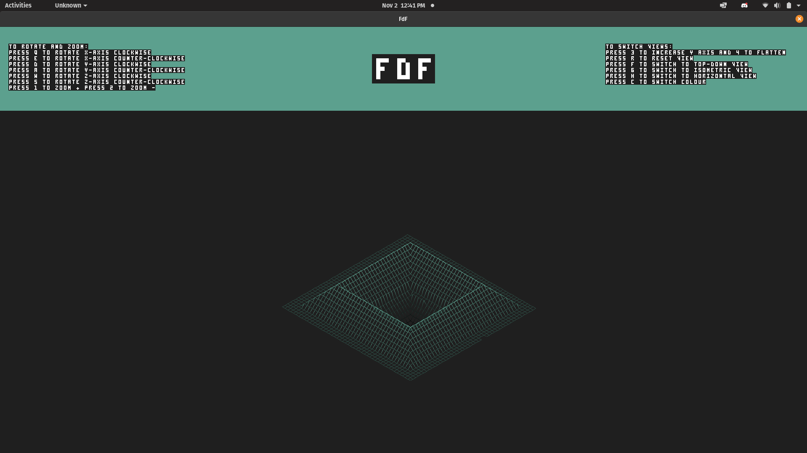

# FDF

## Wireframing project for 42 curriculum at Hive Helsinki

### Goal of the project
Goal of the project was to create a simple wireframing program that would have at least two available projections. In this project we were required to use 42 School MinilibX library to create a window where we can draw. During the project I understood the basics of graphics, projections, camera, how screen space is calculated, colour gradient, pixel manipulation and error management.

The latest repository of the school's MinilibX can be found here. Note, that latest version has a function that releases mlx_init allocated memory properly, so I highly recommend only to use the latest version.
[Link](https://github.com/42Paris/minilibx-linux)

### Features
- Rotation. (Rotating object by it's axis)
- Scaling larger and smaller.
- Translation. (Moving object around)
- Isometric, front and bird-view perspectives.
- Colour gradient using doubles. Lowest value is 0.0 where as largest is 1.0
- Multiple colours.
- Pixel alphabet to write to mlx image instead of the window.

### Reasonings
- I use g42 prefix for project files that I deem usable in other projects and fdf to be project specific prefix.
- I created g42 struct coord to hold 3d coordinates as doubles, and copy it to proj, and then translate those coordinates to screen coordinates.
- I deducted that a valid map has depth coordinates in hexadecimal, combined (1,0xFF) or in decimal notation. Map can also have different row length.
- A valid map has only following characters.
	`0123456789xXabcdefABCDEF,\s\n`

### Links
- MinilibX documentation by Codam students [Link](https://harm-smits.github.io/42docs/libs/minilibx/getting_started.html#compilation-on-linux)
- Neener's tutorial how to use MinilibX, and DDA algorithm. [Link](https://gontjarow.github.io/MiniLibX/)
- Red Blob games tutorial on line tracing [Link](https://www.redblobgames.com/grids/line-drawing.html)
- How to perform isometric transformations [Link](https://github.com/VBrazhnik/FdF/wiki/How-to-perform-isometric-transformations%3F)
- How to do isometric transformations with [Link](https://www.kirupa.com/developer/actionscript/isometric_transforms.htm)
- Essence of Linear Algebra [Link](https://www.youtube.com/playlist?list=PLZHQObOWTQDPD3MizzM2xVFitgF8hE_ab)
- Wikipedia article on rotation matrix [Link](https://en.wikipedia.org/wiki/Rotation_matrix)
- Vectors, points in space and matrices [Link](https://www.scratchapixel.com/lessons/mathematics-physics-for-computer-graphics/geometry/coordinate-systems)
- Why to use floats against doubles [Link](https://stackoverflow.com/questions/24231389/struct-or-class-for-matrix-4x4-object)
- Bresenham's Algorithm implementation using bitwise calculations [Link](https://hbfs.wordpress.com/2009/07/28/faster-than-bresenhams-algorithm/)
- Here are some spatial transformation matrices [Link](https://www.brainvoyager.com/bv/doc/UsersGuide/CoordsAndTransforms/SpatialTransformationMatrices.html)
